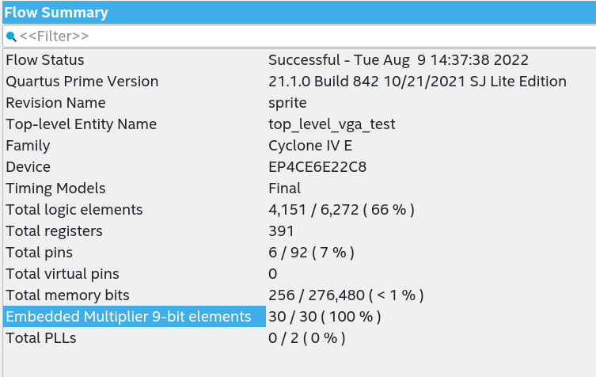
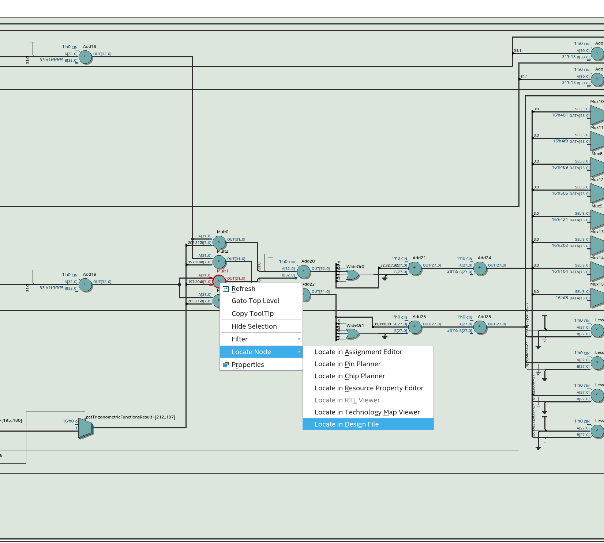
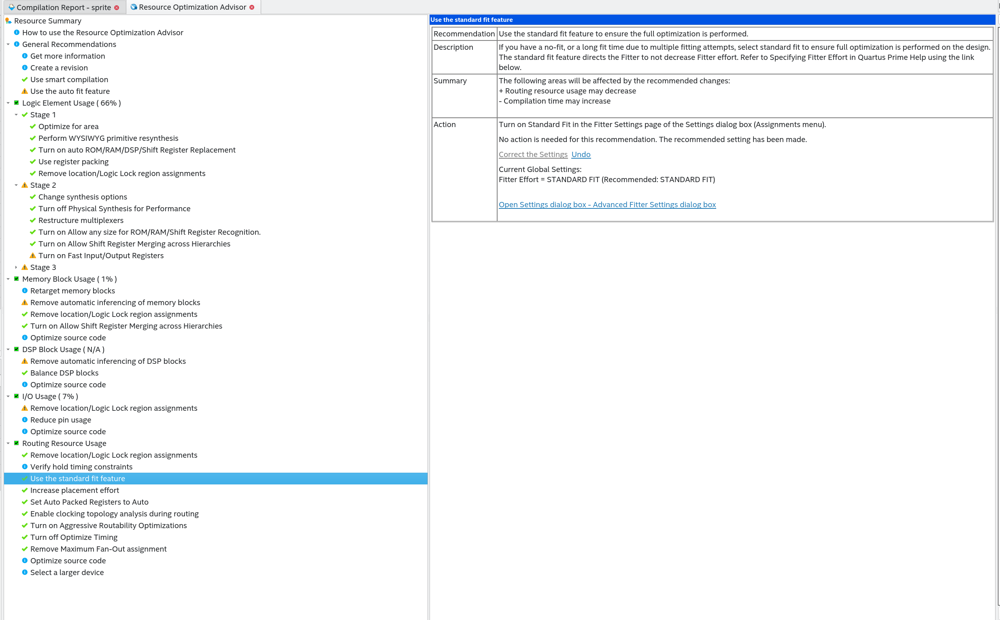

# unnamed_fpga_game
game using vga

## WIP
Two sprites are currently consuming all multipliers, as seen in the quartus summary:


So I search in the RTL diagram where those multipliers where, and search for the design file:




And of course, it pointed out the multipliers in the rotate function:

```
     function rotate(sprite_size : Size2D;
                     position    : Pos2D;
                     rotation    : AngleType := ( others => '0' )) return Pos2D is
        constant trigResults     : TrigonometricFunctionsResultsRecord := getTrigonometricFunctionsResult(rotation);
        variable newPos : Pos2D;
     begin
       -- reinterpret  as sfixed
        newPos.x :=   (position.x * to_integer(signed(to_slv(trigResults.cos)))
                    - (position.y * to_integer(signed(to_slv(trigResults.sin))))) / 64;
        newPos.y :=   ((position.x * to_integer(signed(to_slv(trigResults.sin))))
                    + (position.y * to_integer(signed(to_slv(trigResults.cos))))) / 64;
        return newPos;
     end function;

```

Then I tried to use the automatic optimizations with the optimization advisor:



But the result is the same.

So I found [Embedded multipliers in Cyclone IV Devices](https://www.intel.com/programmable/technical-pdfs/654776.pdf), which says:
```
In addition to the embedded multipliers in Cyclone IV devices, you can implement
soft multipliers by using the M9K memory blocks as look-up tables (LUTs). The LUTs
contain partial results from the multiplication of input data with coefficients that
implement variable depth and width high-performance soft multipliers for low-cost,
high-volume DSP applications. The availability of soft multipliers increases the
number of available multipliers in the device.
```
and links two other documents:
 * [Memory Blocks in Cyclone IV Devices](http://www.altera.com/literature/hb/cyclone-iv/cyiv-51003.pdf)
 * [Implementing Multipliers in FPGA Devices](http://www.altera.com/literature/an/an306.pdf)

So I will need to learn on how to do the LUT implementation to avoid using all multipliers, since I have a lot of available memory to use.


## TODO : 
* remove hardcoded values on boundaries for bouncing. Use sprites constants instead
* integrate input buttons with debouncers
* use vectors for sprites velocities. Instantiate several sprites.
* animate sprites
* add testbench
